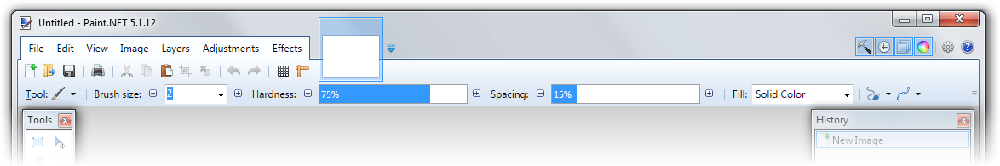

     
    <em><a href="SCREENSHOTS.md">More screenshots</a></em>

# PDNClassic
PDNClassic is a startup hook DLL and icon pack for Paint.NET that makes it look more like older versions, including:
- Aero glass on main window and dialogs
- Fixes for classic theme rendering issues
- All icons from Paint.NET 4.1.5 (last version with old icons) + some custom icons for newer features

## Attribution
Most icons were extracted from Paint.NET 4.1.5, and others were taken from the icon packs Paint.NET sourced its old
icons from. These include:
- **Fugue Icons**: https://p.yusukekamiyamane.com/
- **Crystal Icons**: http://www.everaldo.com/crystal/
- **Oxygen Icons**: http://www.oxygen-icons.org/

## Installation
Download PDNClassic-vX.X.X.zip from the [latest release](https://github.com/aubymori/PDNClassic/releases/latest)
and extract it, after that, there are two parts to installing PDNClassic.

### Icon pack
Copy the contents of the `icons` folder to `C:\Program Files\Paint.NET\Resources`. If you do not want to use the
old icons, then you will need to disable the *Use accommodations for old icons* option after installing the hook.

The icon pack can work separately without the hook DLL, but certain things will look wrong (font format icons, shape rendering, etc.).

### Hook
The preferred method of using the hook is Windhawk, but any method that will allow you to ensure Paint.NET starts up
with the hook DLL's path in `DOTNET_STARTUP_HOOKS` will work.

1. Install [Windhawk](https://windhawk.net/) if you have not already.
2. In the UI, create a new mod.
3. Copy the contents of `loader.wh.cpp` and paste it over the existing contents in the mod editor.
4. Click Compile and wait for it to compile, then exit the mod editor.
5. Copy `PDNClassic.dll` to a place where you know you won't delete it accidentally.
6. Under the PDNClassic Loader mod, click Details, and then go to the Settings tab.
7. In the *Path to PDNClassic.dll* setting, paste the path to the DLL you just copied (without quotes).
8. Click Save settings.

## Updating
To update PDNClassic when a new version is released, just make sure Paint.NET is closed, and then replace your existing
icon pack and/or hook DLL with the new ones.